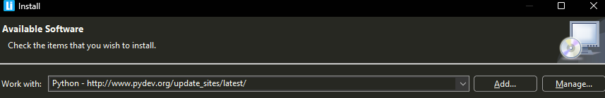
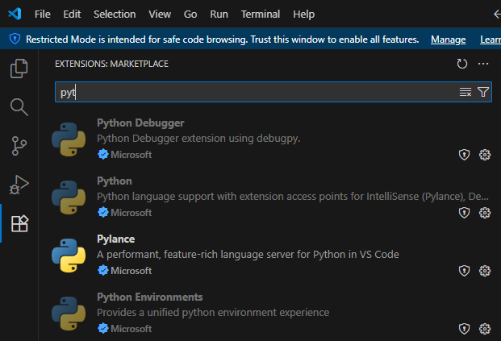

# Punto 2.2: Gestión de módulos y extensiones en el entorno de desarrollo

## IDEs utilizados
- **IDE 1:** LiClipse (libre)
- **IDE 2:** Visual Studio Code (propietario)

## Descripción de la tarea
En cada IDE he instalado extensiones o módulos para ampliar la funcionalidad del entorno. En ambos casos elegí módulos relacionados con el desarrollo en Python, documentando cada paso del proceso y las mejoras obtenidas para el trabajo de desarrollo.

## Respuestas a preguntas evaluativas

### Pregunta 1: ¿Cómo fue el proceso de instalación de extensiones o módulos en cada IDE?
- **LiClipse:** El proceso consiste en acceder al menú de plugins y buscar el módulo deseado (por ejemplo, soporte adicional de Python o autocompletado). LiClipse utiliza el sistema de instalación de Eclipse, donde se añaden repositorios de actualizaciones y se seleccionan los módulos a instalar. Es necesario reiniciar el IDE para que los cambios tengan efecto.
- **Visual Studio Code:** Basta con ir al panel de extensiones, buscar la extensión (por ejemplo, “Python”), y pulsar el botón de instalar. El proceso es inmediato y no requiere reinicios ni configuración adicional; las extensiones quedan activas al instante.

### Pregunta 2: ¿Qué beneficios proporcionan las extensiones o plugins que instalaste para el desarrollo de tus proyectos?
- **LiClipse:** Permiten ampliar las capacidades nativas del IDE, añadiendo autocompletado, depuración avanzada, integración con herramientas externas, y soporte para diferentes lenguajes. Esto mejora la productividad y facilita el desarrollo profesional en Python.
- **Visual Studio Code:** Las extensiones permiten agregar análisis de código, autocompletado inteligente, depuración, integración con control de versiones y ejecución de scripts. El ecosistema es muy amplio, por lo que se puede adaptar el entorno fácilmente a cualquier necesidad específica del proyecto.

## Evidencias

