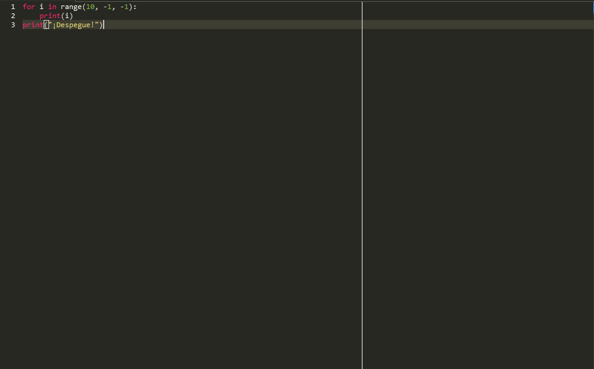

# Punto 2.6: Generación de ejecutables con diferentes IDEs a partir del mismo código fuente

## IDEs utilizados
- **IDE 1:** LiClipse (libre)
- **IDE 2:** Visual Studio Code (propietario)

## Descripción de la tarea
Escribí un programa en Python que cuenta de 10 a 0 y luego imprime “¡Despegue!”. Ejecuté el mismo fichero `.py` en ambos IDEs para analizar y comparar sus funcionalidades y comodidad de uso.

## Respuestas a preguntas evaluativas

### Pregunta 1: ¿Qué diferencias encontraste al ejecutar el mismo código fuente en diferentes IDEs?
- **LiClipse:** La ejecución se realizó desde el menú contextual o desde el botón de “Run” específico del entorno, que integra el intérprete de Python. El entorno muestra la salida en la consola interna del IDE y permite depuración paso a paso. La integración y configuración pueden requerir algunos ajustes previos para funcionar correctamente.
- **Visual Studio Code:** Al tener instalada la extensión de Python, la ejecución se hace directamente con solo pulsar “Run” sobre el archivo. La terminal interna muestra el resultado al instante. VS Code también sugiere y ejecuta el script en entornos virtuales si están configurados, y la interacción es más rápida y fluida.

### Pregunta 2: ¿Cuál de los IDEs te pareció más cómodo o eficiente para ejecutar el código Python o el lenguaje que hayas elegido? ¿Por qué?
Visual Studio Code me resultó más cómodo y eficiente por su facilidad de ejecución directa, integración inmediata con entornos virtuales y la terminal integrada. No requiere configuración adicional y la experiencia es más intuitiva, especialmente para tareas rápidas y pruebas de código, aunque LiClipse ofrece más herramientas específicas para depuración y desarrollo avanzado si la configuración está bien realizada.

## Evidencias

