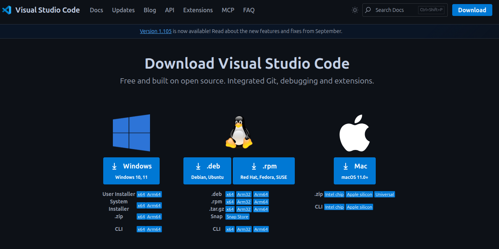
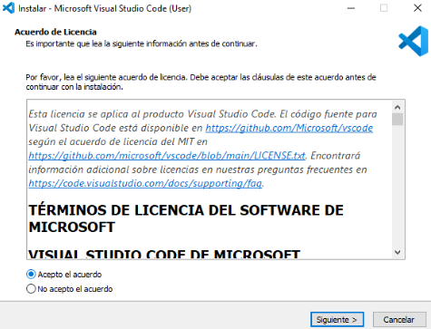
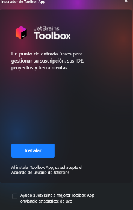
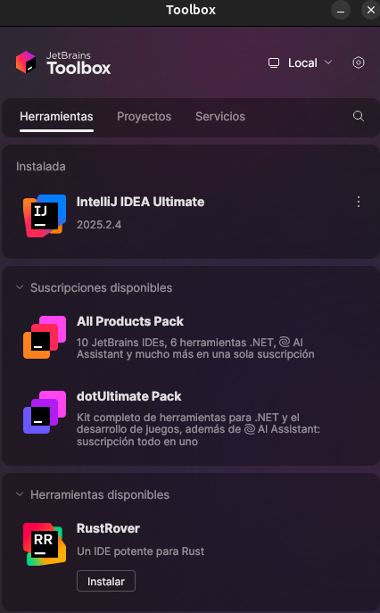

# Punto 1: Instalación de entornos de desarrollo, propietarios y libres

## IDEs utilizados
- **IDE 1:** [Nombre IDE libre - Visual Studio Code] - Versión 1.105.1
- **IDE 2:** [Nombre IDE propietario - Fleet] - Versión 1.48.261

## Descripción de la tarea
- Para realizar la instalación de visual studio code deberemos realizar lo siguiente:

    - Primero buscaremos la pagina de descarga de visual studio code o entraremos [aqui](https://code.visualstudio.com/Download)
    - Luego seleccionaremos que tipo de descarga haremos dependendiendo del sistema operativo en el que nos encontremos:
        

    - Una vez descargado dependiendo de el sistema elegido haremos los siguiente:
    - **En linux:**
        - Nos dirigiremos a la terminal y ejecutaremos el siguiente comando
        ```bash
        sudo apt install ./ruta_archivo_descargado/nombre_archivo_descargado
        ```
        - Introduciremos la contraseña y ya se estará instalando

    - **En Windows:**
        - Nos dirigiremos a donde tengamos instalado el archivo de instalacion y lo abriremos
        - Despues aceptaremos los terminos y condiciones le daremos a siguiente y empezaremos con la instalacion:

            

- Para instalar fleet primero deberemos de instalar jetbrains toolbox, podremos hacerlo desde el siguiente [enlace](https://www.jetbrains.com/es-es/toolbox-app/), una vez descargado depende del sistema haremos los siguiente:

    - **En linux:**

        - Haremos algo parecido a visual studio code, introduciremos el siguiente comando:
            ```bash
            sudo tar -xvzf ~/ruta_archivo_descargado/nombre_archivo_descargado
            ```

    - **En Windows:**

        - Iremos a donde tengamos el instalador y lo ejecutaremos, aceptaremos los terminos y ya se instalará

    - Una vez vayamos a instalarlo veremos algo asi:

        
        
        Simplemente le daremos a instalar

    - Luego de esto veremos una ventanita asi:

        

        En la lupa buscaremos el nombre del ide y le daremos a instalar
## Respuestas a preguntas evaluativas

### Pregunta 1: ¿Qué diferencias encontraste en el proceso de instalación entre el IDE propietario y el libre?
- No hay mucha diferencia notoria en las instalaciones, lo que se podria destacar es que para visual studio code lo haces directamente desde la pagina y ya lo tienes listo y para fleet primero tienes que instalar jetbrains toolbox.

### Pregunta 2: ¿Qué ventajas identificaste en cada uno de los entornos durante la instalación?
- En ambos la instalacion es sencilla, en fleet se podria destacar que si estas familiarizado con los IDEs de jetbrains se te puede hacer más sencillo adaptarte.
