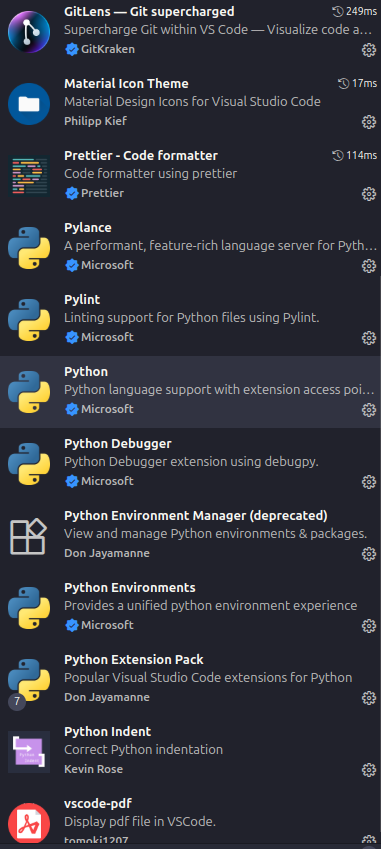
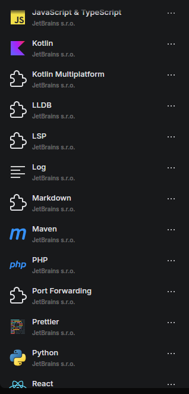

# Punto 2: Gestión de módulos y extensiones en el entorno de desarrollo

## IDEs utilizados
- **IDE 1:** [Visual Studio Code]
- **IDE 2:** [Fleet]

## Descripción de la tarea

- En Visual Studio Code:
    - Paquete de extension de python para poder trabajar con el lenguaje, prettier para un mejor formateado de código, vscode-pdf para poder visualizar archivos pdf dentro del mismo ide, error lens para mejores mensajes de error.

- En Fleet:
    - Al ya venir instaladas las extensiones voy a comentar algunas de las que les voy a dar uso; prettier al igual que en visual studio code y python para poder hacer uso de este lenguaje y kotlin para lo mismo.

## Respuestas a preguntas evaluativas

### Pregunta 1: ¿Cómo fue el proceso de instalación de extensiones o módulos en cada IDE?
- En Visual Studio Code debemos de dirigirnos al apartado de extensiones y alli buscar las extensiones que deeseemos, en cambio, en fleet las extensiones disponibles ya vienen preinstaladas cuando instalas el IDE
### Pregunta 2: ¿Qué beneficios proporcionan las extensiones o plugins que instalaste para el desarrollo de tus proyectos?
- En Visual Studio Code he instalado algunas como Error lens que te mejora los mensajes de error, avisos, etc... Prettier para un mejor formateo del codigo, Paquete de extension python para poder hacer uso del lenguaje.

- En Fleet hay diferentes extensiones para diversos idiomas como Python, Kotlin, Java, C, etc, tambien tiene instalado prettier al igual que Visual Studio Code
## Evidencias

