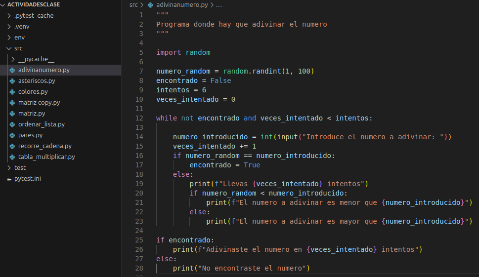
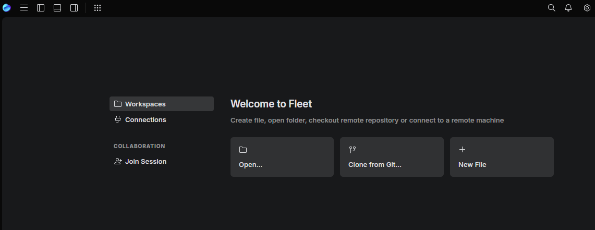
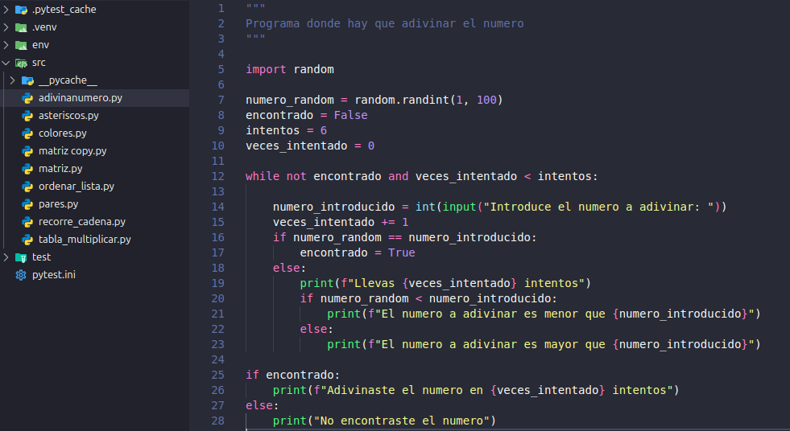
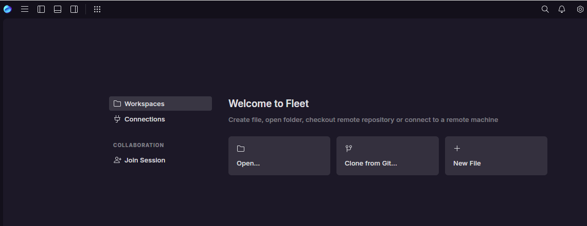
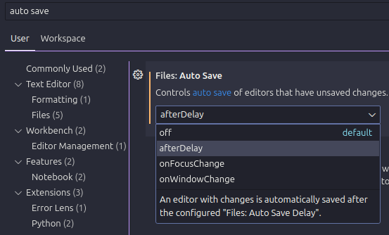
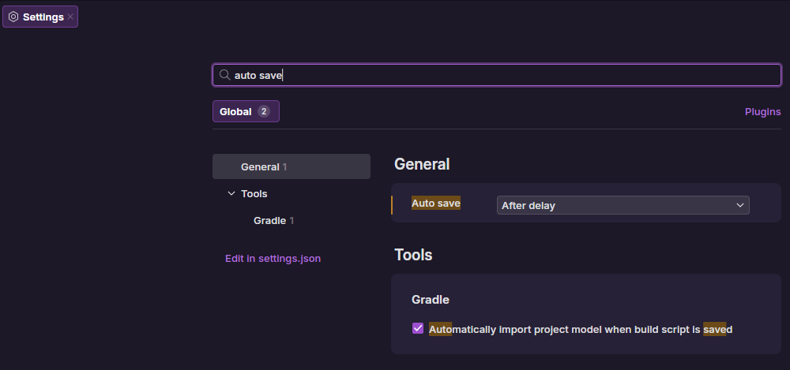

# Punto 3: Personalización y automatización del entorno

## IDEs utilizados
- **IDE 1:** [Visual Studio Code]
- **IDE 2:** [Fleet]

## Descripción de la tarea
[Explica qué personalizaciones realizaste: tema, atajos de teclado, automatización de tareas]

### Personalizaciones realizadas
- Tema: Dracula theme oficial
- Atajos de teclado: Configurada la seleccion de varios elementos que sean iguales para un atajo más accesible
- Automatización: Auto guardado del archivo cuando deje de escribir para no tener que hacerlo manualmente

## Respuestas a preguntas evaluativas

### Pregunta 1: ¿Qué aspectos del entorno personalizaste y cómo mejoró tu experiencia de desarrollo?
- He personalizado aspectos como pueden ser el tema, iconos, tareas y atajos de teclado. Esto ha mejorado mi experiencia de desarrollo de forma que visualmente se vea mejor, más facil de diferenciar las cosas y mayor accesibilidad para atajos de teclado.

### Pregunta 2: ¿Cómo configuraste la automatización de tareas y en qué te benefició durante el trabajo?
- He configurado que se autoguarden los cambios que hago en los ficheros de forma que no tenga que guardarlos yo manualmente

## Evidencias
**ANTES:**

**DESPUÉS:**

**AUTOMATIZACIÓN:**

