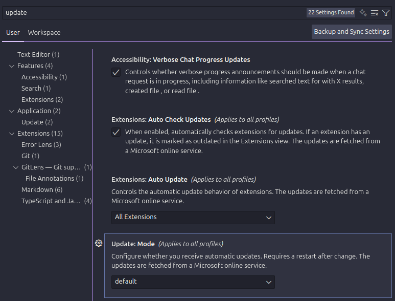
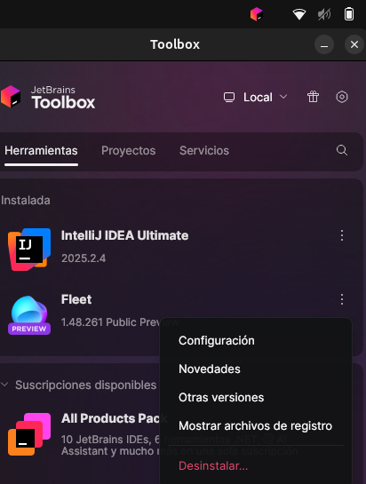

# Punto 4: Configuración del sistema de actualización del entorno de desarrollo

## IDEs utilizados
- **IDE 1:** [Nombre y versión]
- **IDE 2:** [Nombre y versión]

## Descripción de la tarea
[Explica cómo configuraste el sistema de actualizaciones en cada IDE]

## Respuestas a preguntas evaluativas

### Pregunta 1: ¿Cómo configuraste las actualizaciones automáticas en cada IDE?
[Tu respuesta aquí]

### Pregunta 2: ¿Por qué es importante mantener el IDE actualizado en proyectos de desarrollo?
[Tu respuesta aquí]

## Evidencias

## Observaciones
[Comentarios adicionales]
