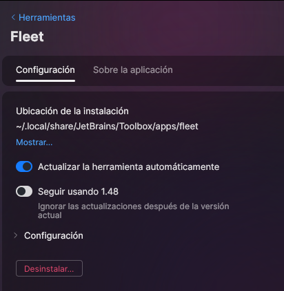

# Punto 4: Configuración del sistema de actualización del entorno de desarrollo

## IDEs utilizados
- **IDE 1:** [Visual Studio Code]
- **IDE 2:** [Fleet]

## Respuestas a preguntas evaluativas

### Pregunta 1: ¿Cómo configuraste las actualizaciones automáticas en cada IDE?
- En Visual Studio Code:
            
        - En Fleet: 
            - Le damos a los 3 puntos y activamos actualizaciones automaticas
                 

### Pregunta 2: ¿Por qué es importante mantener el IDE actualizado en proyectos de desarrollo?
- Porque al mantener actualizado el IDE podemos acceder a las versiones más recientes de las diferentes funcionalidades las cuales nos son de ayuda a la hora de desarrollar