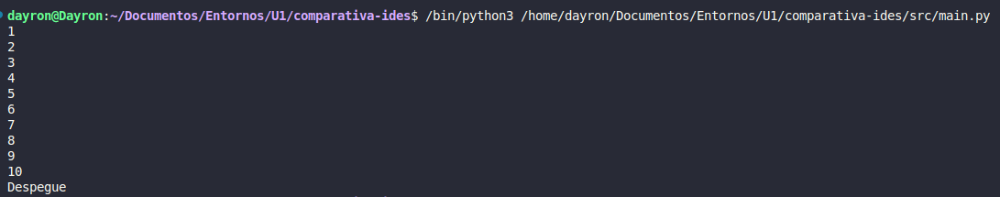
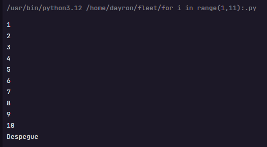

# Punto 6: Generación de ejecutables con diferentes IDEs a partir del mismo código fuente

## IDEs utilizados
- **IDE 1:** [Visual Studio Code]
- **IDE 2:** [Fleet]

## Descripción de la tarea
Programa "cuenta atrás" en Python que cuenta de 10 a 0 y luego imprime "¡Despegue!"

## Código implementado

```python
# Código Python del programa cuenta atrás
for i in range(1, 11):
    print(i)
    
print("Despegue")
```

## Respuestas a preguntas evaluativas

### Pregunta 1: ¿Qué diferencias encontraste al ejecutar el mismo código fuente en diferentes IDEs?
- Ninguna la verdad a la hora de ejecutar es lo mismo

### Pregunta 2: ¿Cuál de los IDEs te pareció más cómodo o eficiente para ejecutar el código Python o el lenguaje que hayas elegido? ¿Por qué?
- Me parece más cómodo Visual Studio Code porque es con el que estoy más familiarizado
## Evidencias


