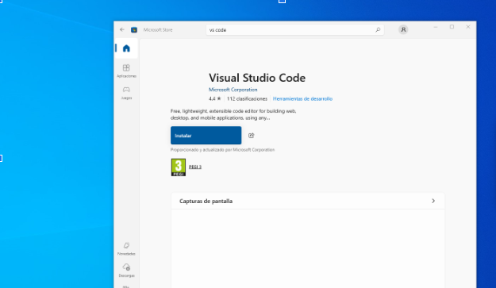
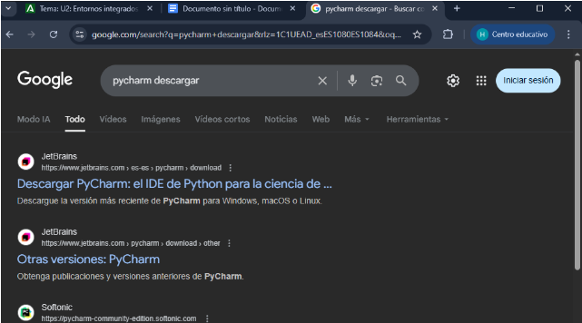
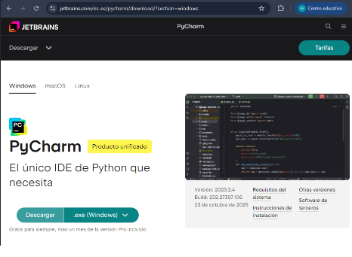
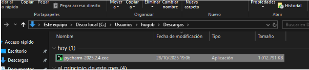
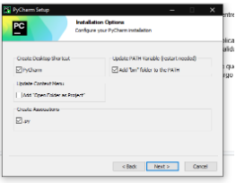
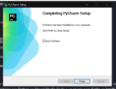

# 2. Parte individual

## Tarea individual

### Visual Studio Code
- Entorno libre

### Pycharm
- Entorno propietario

---

## Preguntas evaluativas

### ¿Qué diferencias encontraste en el proceso de instalación entre el IDE propietario y el libre?

- **Visual Studio Code**: es más rápido de instalar, desde la propia aplicación de Microsoft se puede instalar muy fácilmente. Ocupa menos espacio ya que en realidad es un editor de código.
- **Pycharm**: puede llegar a ser más pesado de instalar, ya que tiene que ser desde Google y, a diferencia de VS Code, el proceso de instalación es mucho más largo. También ocupa más espacio y está dedicado para programar en Python.

### ¿Qué ventajas identificaste en cada uno de los entornos durante la instalación?

- **Pycharm**: instalación más completa y guiada, pudiendo configurar el entorno desde el inicio e integrar herramientas. Detecta intérpretes de Python y, si no los tienes instalados, los instala.
- **Visual Studio Code**: proceso de instalación mucho más sencillo que Pycharm. Cuando lo instalas puedes empezar a usarlo sin necesidad de instalar nada.

---
