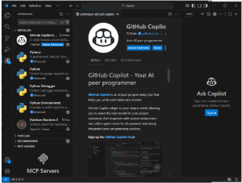
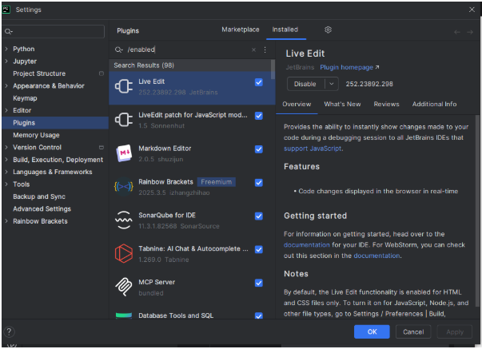

## 2.2. Gestión de módulos y extensiones en el entorno de desarrollo (CE 2.b)

### Tarea individual

#### Visual Studio Code
- Python (Para poder hacer códigos en Python)
- Pylance (Autocompleta)
- Rainbow Brackets (Colorea corchetes para identificar más fácil)
- GitHub Copilot (IA) *(deshabilitada)*

#### Pycharm
- Rainbow Brackets (mismo que VS Code)
- Markdown
- Docker (Integra contenedores)
- Tabnine (autocompleta con IA)
- SonarLint (Analiza el código)
- SQL-Support (bases de datos)
- LiveEdit (para ver cambios en vivo en el navegador, perfecto para HTML)

---

### Preguntas evaluativas

#### ¿Cómo fue el proceso de instalación de extensiones o módulos en cada IDE?

- **Visual Studio Code**: muy sencillo, desde el apartado de “Extensiones” se pueden encontrar muy fácilmente. Una vez encontrada, le das a “install” y listo.
- **Pycharm**: puede ser un poco más difícil de localizar dónde están los plugins, pero una vez que sabes dónde están, es sencillo. Algunos requieren reiniciar el IDE, cosa que en VS Code no pasa.

#### ¿Qué beneficios proporcionan las extensiones o plugins que instalaste para el desarrollo de tus proyectos?

- Son de ayuda para completar código o para ver mejor el código.

---
