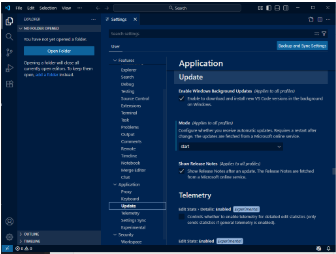
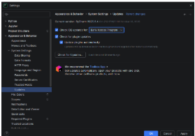

## 2.4. Configuración del sistema de actualización del entorno de desarrollo (CE 2.d)

### ¿Cómo configuraste las actualizaciones automáticas en cada IDE?

- **Visual Studio Code**: vamos a “Settings”, buscamos en el apartado “Application” → “Update”, seleccionamos “Mode” y lo ponemos en `start`.

- **Pycharm**: vamos a “File” → “Settings” → “Appearance & Behavior” → “System Settings” → “Updates”.

### ¿Por qué es importante mantener el IDE actualizado en proyectos de desarrollo?

- Para tener mejor rendimiento, plugins funcionales, nuevas funcionalidades y corregir errores o vulnerabilidades de seguridad.

---
