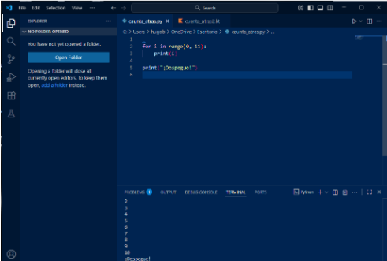

## 2.5. Generación de ejecutables a partir de código fuente en distintos lenguajes en un mismo IDE (CE 2.e)

### ¿Cuál fue el proceso para ejecutar el mismo programa en diferentes lenguajes dentro del mismo IDE?

- Abrimos VS Code y creamos el programa, en mi caso `cuenta_atras.py`. Luego escribo el código en Python, asegurándome de haber descargado el intérprete de Python. Usando la terminal de VS Code lo ejecutamos.

### ¿Qué diferencias encontraste en la generación del ejecutable entre los dos lenguajes?

- No he sabido instalar Kotlin y no he podido usarlo (culpa mía).

